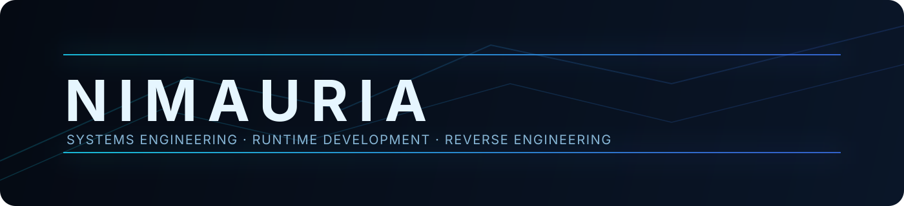

<!--
Profile README maintenance notes:
- Update the introduction and interests sections for current focus.
- Keep project status wording accurate (experimental unless verified otherwise).
- Update links only with publicly available, working URLs.
-->

  

## Nimauria

Software engineer focused on systems programming, runtime internals and low-level graphics pipelines. I spend most of my time in C++20 working on native tooling, reverse engineering workflows and performance-critical cross-platform architecture.

I am especially interested in game technology, emulation, ahead-of-time recompilation and optimisation work where small design choices have big runtime impact.

## Technology Stack

`C++20` · `CMake` · `MSVC` · `GCC` · `Clang` · `Direct3D 12` · `Vulkan` · `Qt/QML`

## Featured Project: Project Xenon

**[Project Xenon (Xenon-Recomp)](https://github.com/nimauria/Xenon-Recomp)** is an ongoing **experimental** Xbox 360 native recompilation framework that aims to translate Xbox 360 PowerPC software into native executable code.

Current engineering areas include:

- Xenon PowerPC and VMX128 support
- Native ahead-of-time recompilation
- Xbox 360 XEX loading and guest memory management
- Xbox kernel and runtime compatibility
- Xenos graphics translation
- Direct3D 12 and Vulkan graphics backends
- Cross-platform development and tooling
- CMake + MSVC/GCC/Clang build support
- Qt/QML launcher development

Related experimental efforts include **Project Gracemeria** (Ace Combat 6) and **Project Gaia** (Sonic Unleashed).

> Status note: these are active R&D projects. Features and compatibility are evolving, and nothing here should be interpreted as a claim of full game playability or completion.

## Current Engineering Interests

- Native runtime architecture and executable translation pipelines
- Reverse engineering methodology for complex console-era software
- Graphics API abstraction across modern backends
- Deterministic performance profiling and optimisation
- Sustainable cross-platform build and release engineering

